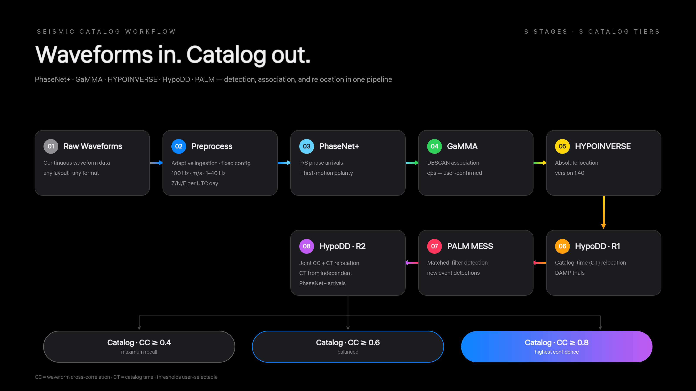

# Seismology Agent — workflow revision 0.3.0-dev

Agent-guided seismology workflow: PhaseNet+ picking, GaMMA association, HYPOINVERSE location, HypoDD relocation and PALM MESS detection — from raw waveforms to multi-grade earthquake catalogs（全CUG（武汉）最好用的指导agent从连续波形到地震目录制作框架）.

## Three steps to a catalog

1. **Get the package** — clone this repository, download the assets of the [v0.3.0-dev release](../../releases/tag/v0.3.0-dev), and run `scripts/restore_offline_assets.sh <download-dir>` to restore the runtime archives, model weights and native binaries.
2. **Hand it to an agent** — point the agent at [AGENTS.md](AGENTS.md). It is self-contained; the agent reads the docs and skills it needs. No conversation history is required.
3. **Point it at your data** — give the agent your raw waveforms, response information and station metadata, plus a new run directory. The agent writes the dataset-specific preprocessing and then drives the stages `preprocess → picking → association → location → relocation → detection → post_detection_relocation`, pausing at documented decision points (GaMMA eps, HypoDD DAMP...) for your confirmation.

Deployment commands and runtime options: [docs/DEPLOYMENT.md](docs/DEPLOYMENT.md).

## Workflow overview

Still hand-coding? Still doing research the old-fashioned way? So last season!

- **Messy data? Unfamiliar formats? No fixed ingestion code.** The preprocessing stage intentionally ships none: the agent inspects your raw inputs and writes the dataset-specific adaptation itself, while the scientific configuration stays pinned (instrument-response removal to m/s, 1–40 Hz bandpass with Nyquist fallback, demean/detrend and taper handling, resample to 100 Hz, explicit per-channel merge). Output lands in a standard archive: one UTC day per station, three components.
- **Parameters are derived and confirmed, not guessed.** Every later stage computes reference parameters from the actual upstream data and asks you to confirm or override them — compute resources at start-up, GaMMA's DBSCAN eps, the HypoDD DAMP trials, and more. The papers and software manuals behind every stage are exported into a layered LLM-Wiki knowledge base, so parameter choices are cross-checked against the cited sources instead of hallucinated defaults.
- **QC at every stage.** Each stage ships data-driven visual checks and validity reports; a green contract is never silently treated as scientific truth, and empty or degraded products are reported rather than hidden. Until full AGI arrives, guided semi-automatic research is the practical optimum.
The workflow executed accurately on GLM-5.3, Kimi K3 and GPT-5.6; a 1M-token context window gives the best experience.

A reusable workflow for a general agent to prepare regional seismic data and execute PhaseNet+, GaMMA, HYPOINVERSE, first-round CT HypoDD, PALM MESS, and post-MESS joint CC+CT HypoDD. The final joint stage uses independent PhaseNet+ arrivals for CT and produces exactly three CC-threshold catalogs. The agent adapts uncertain raw input layouts; standardized archives, maintained converters, versioned tools, contracts and QC connect the scientific stages.

Project-authored code uses MIT; third-party software retains its own terms.

This release targets **Linux x86-64** and includes pinned native binaries and a local PhaseNet+ checkpoint in the offline distribution. Its environment snapshots originate from a glibc 2.31 host. Run the compatibility checks on the destination machine. See [validation scope](docs/VALIDATION.md); another physical machine and another observed region must be evaluated there before claiming they have been tested.

## References

Workflow software and methods:

- Zhu, W., & Beroza, G. C. (2019). PhaseNet: a deep-neural-network-based seismic arrival-time picking method. *Geophysical Journal International*, 216, 261–273. https://doi.org/10.1093/gji/ggy423
- Zhu, W., McBrearty, I. W., Mousavi, S. M., Ellsworth, W. L., & Beroza, G. C. (2022). Earthquake phase association using a Bayesian Gaussian mixture model. *Journal of Geophysical Research: Solid Earth*, 127, e2021JB023249. https://doi.org/10.1029/2021JB023249
- Klein, F. W. (2002). User's guide to HYPOINVERSE-2000, a Fortran program to solve for earthquake locations and magnitudes (ver. 1.0). *USGS Open-File Report* 02-171.
- Waldhauser, F. (2001). hypoDD — A program to compute double-difference hypocenter locations. *USGS Open-File Report* 01-113.
- Zhou, Y., Yue, H., Fang, L., Zhou, S., Zhao, L., & Ghosh, A. (2022). An earthquake detection and location architecture for continuous seismograms: Phase picking, association, location, and matched filter (PALM). *Seismological Research Letters*, 93(1), 413–425. https://doi.org/10.1785/0220210111

Agent-guided science:

- Zhou, J., Zhang, B., Li, G., Chen, X., Li, H., Xu, X., Chen, S., He, W., Xu, C., Liu, L., & Gao, X. (2024). An AI agent for fully automated multi-omic analyses. *Advanced Science*, 11, 2407094. https://doi.org/10.1002/advs.202407094
- Zhang, J., Clairmont, C., Que, X., Li, W., Chen, W., Li, C., & Ma, X. (2025). Streamlining geoscience data analysis with an LLM-driven workflow. *Applied Computing and Geosciences*, 25, 100218. https://doi.org/10.1016/j.acags.2024.100218
- Ren, Y., Yu, S., Chen, K., & Ma, J. (2025). Seismology modeling agent: A smart assistant for geophysical researchers. *arXiv:2512.14429*.

