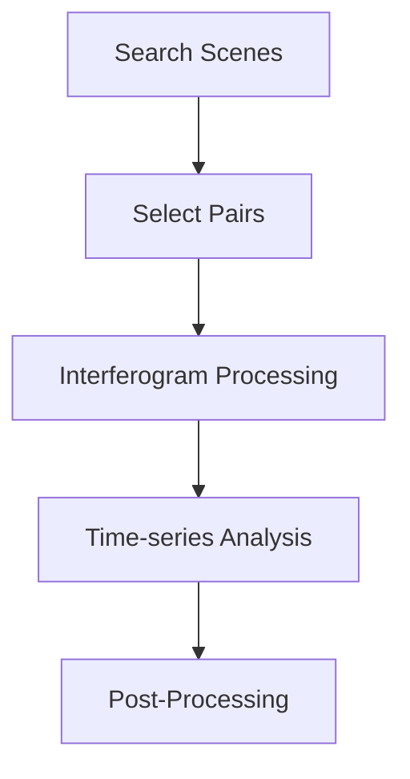
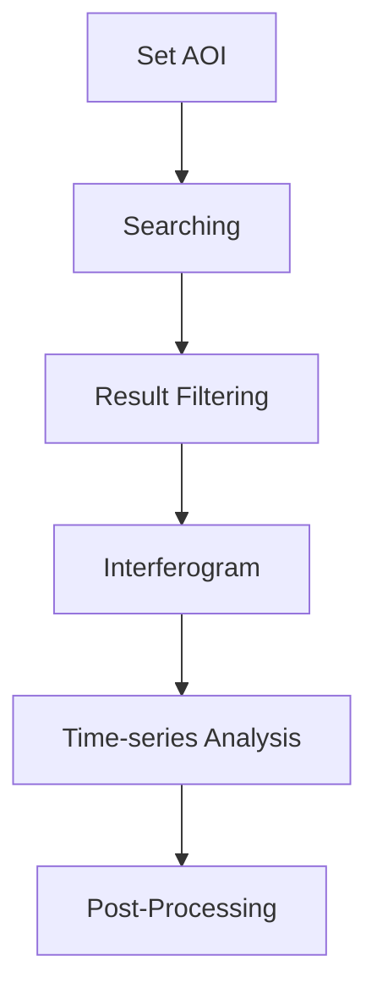

# InSARHub v0.4.2 documentation: installation, account setup, CLI workflows

Source: insarhub-docs-v042-cli.md
Extraction: markdown source; logical page anchors, starting at 1.
The source is a repository markdown document, not a typeset PDF.


## PDF page 1

### Install Locally

=== "Minimal"

    ??? note "Install InSARHub in a fresh environment "

        ```bash
        conda create -n insarhub python=3.12
        conda activate insarhub
        ```

    ??? note "Limit Windows support"
        Currently InSARHub only test running under Python version 3.11 in Windows environment 

    ```bash
    conda install insarhub -c conda-forge
    ```

    Or from pip (GDAL must be installed via conda first):

    ```bash
    conda install gdal
    pip install insarhub
    ```

=== "ISCE2 Processor"

    Adds local interferogram processing via ISCE2 `stackSentinel`.

    ??? note "No Windows Support"
        ISCE2 is only available on Linux and macOS (x86_64). Not available for Windows or Apple Silicon natively — use WSL2 or a Linux virtual machine.
    ??? note "Restricted numpy version"
        ISCE2 currently pins `numpy<2`

    Install InSARHub first, then add ISCE2 into the same environment:

    ```bash
    conda install insarhub -c conda-forge
    conda install isce2 -c conda-forge
    ```

    Via pip:

    ```bash
    
    conda install gdal isce2
    pip install insarhub
    ```

    Verify ISCE2 installed correctly:

    ```bash
    python -c "import isce; print(isce.__version__)"
    ```

=== "ISCE3 + Dolphin Processor"

    Adds local burst processing via ISCE3 / COMPASS (geocoded CSLCs) and dolphin (phase linking + time series)

    ??? note "No Windows Support"
        The ISCE3 / COMPASS / dolphin stack is Linux and macOS (x86_64) only — use WSL2 or a Linux virtual machine on other platforms.
        
    ??? note "Restricted numpy version"
        COMPASS currently pins `numpy<2`

    ```bash
    conda create -n isce3_dolphin python=3.12
    conda activate isce3_dolphin
    conda install -c conda-forge insarhub isce3 compass sardem dolphin snaphu burst2safe gdal
    ```

    Verify the stack imports:

    ```bash
    python -c "import isce3, compass, dolphin; print('ok')"
    ```

=== "GMTSAR Processor"

    Adds local interferogram processing via GMTSAR plus MintPy time-series.
    ??? note "No Windows Support"
        `--system conda-linux-full` is **Linux x86_64 only**, use WSL2 or a Linux virtual environment on other platforms.

    ```bash
    # 1. Clone the full GMTSAR repo and build it (creates a conda env named "gmtsar")
    git clone https://github.com/gmtsar/gmtsar.git
    cd gmtsar
    python3 gmtsar/python/install.py --system conda-linux-full

    # 2. Add InSARHub + MintPy into that same env
    conda activate gmtsar
    conda install -c conda-forge insarhub mintpy

    # 3. Put GMTSAR's binaries on PATH (add to your shell profile to persist)
    export GMTSAR=$(pwd)
    export PATH=$GMTSAR/bin:$PATH
    ```

    Verify:

    ```bash
    which p2p_processing && gmt --version
    python -c "import insarhub, mintpy; print('ok')"
    ```

---

### Use Container

InSARHub support container via **Docker**,  check the [official guide](https://docs.docker.com/get-started/get-docker/) to install Docker on you machine. 

User may choose to run inside container or install base `InSARHub` locally and run each processor/analyzer via `--container` 

Currently InSARHub support:

=== "Hyp3 + Mintpy"
    Default InSARHub container that support sentinel-1 processing via Hyp3 and time-series analysis via Mintpy

    ```bash
    ghcr.io/jldz9/insarhub-base:0.4.0

    ```

=== "ISCE2 + MintPy"

    Covers the `ISCE2_S1` processor and `ISCE2_Mintpy_SBAS` analyzer 

    ```bash
    ghcr.io/jldz9/insarhub-isce2-mintpy:0.4.0
    ```

=== "ISCE3 + Dolphin"

    Covers `ISCE3_Burst` (Sentinel-1 bursts) and `ISCE3_NISAR` (NISAR GSLC), plus the `ISCE3_Dolphin_S1_PL` and `ISCE3_Dolphin_NISAR_PL` analyzers 
    
    ```bash
    ghcr.io/jldz9/insarhub-isce3-dolphin:0.4.0

    ```

=== "GMTSAR + Mintpy"

    Covers the `GMTSAR_S1` processor and GMTSAR analyzers 

    ```bash
    ghcr.io/jldz9/insarhub-gmtsar-mintpy:0.4.0
    ```
---

### Development Setup

=== "Default"

    ```bash
    git clone https://github.com/jldz9/InSARHub.git
    cd InSARHub
    conda env create -f environment.yml -n insar_dev
    conda activate insar_dev
    pip install -e .
    ```

    !!! note "Windows: use Python 3.11"
        `environment.yml` allows Python 3.11 or 3.12, but only 3.11 is currently supported on Windows. If the solve picks 3.12, edit the `python` line in `environment.yml` to `python=3.11` before running `conda env create`.

=== "ISCE2 Processor"

    ```bash
    git clone https://github.com/jldz9/InSARHub.git
    cd InSARHub
    conda env create -f environment.yml -n insar_dev
    conda activate insar_dev
    conda install -c conda-forge "numpy<2.0" isce2
    pip install -e .
    ```

=== "ISCE3 + Dolphin Processor"

    ```bash
    git clone https://github.com/jldz9/InSARHub.git
    cd InSARHub
    conda create -n isce3_dolphin python=3.12
    conda activate isce3_dolphin
    conda install -c conda-forge isce3 compass sardem dolphin snaphu burst2safe gdal
    pip install -e .
    ```

=== "GMTSAR Processor"

    ```bash
    # Build GMTSAR from source into a conda env named "gmtsar"
    git clone https://github.com/gmtsar/gmtsar.git
    cd gmtsar
    python3 gmtsar/python/install.py --system conda-linux-full
    export GMTSAR=$(pwd) && export PATH=$GMTSAR/bin:$PATH

    # Add MintPy + InSARHub (editable) into that env
    conda activate gmtsar
    conda install -c conda-forge mintpy
    git clone https://github.com/jldz9/InSARHub.git
    cd InSARHub
    pip install -e .
    ```

??? note "Using mamba for faster solves"

    Replace `conda` with `mamba` in any of the above commands if you have [mamba](https://mamba.readthedocs.io/en/latest/installation/mamba-installation.html) installed.


## PDF page 2

This program requires several API accounts for full functionality. Registration for all of these services is completely free.

#### [NASA Earthdata](https://urs.earthdata.nasa.gov/)

This account is required for searching satellite scenes, downloading DEMs and orbit files, and submitting online interferogram processing jobs.

Once the registration is complete create a file named `.netrc` under your home directory if not exist and add 
```bash
machine urs.earthdata.nasa.gov
    login Your_Earthdata_username
    password Your_Earthdata_password
```
`OR`

The program will prompts for login on first use.<br><br>


#### [Copernicus Data Space Ecosystem](https://dataspace.copernicus.eu/)

This account is required for downloading orbit files. CDSE releases orbit files a few hours to days earlier than ASF. If CDSE is unavailable or returns an error, InSARHub automatically falls back to ASF for orbit downloads.

Once the registration is complete create a file named `.netrc` under your home directory if not exist and add 

```bash 
machine dataspace.copernicus.eu
    login Your_CDSE_username
    password Your_CDSE_password 

```

`OR` 

The program will prompts for login on first use.<br><br>

#### [Copernicus Climate Data Store](https://cds.climate.copernicus.eu/)

This account is required to perform tropospheric correction using PyAPS.

Once the registration is complete create a file named `.cdsapirc` under your home directory if not exist and add
you [API Token](https://cds.climate.copernicus.eu/how-to-api):

```bash
url: https://cds.climate.copernicus.eu/api
key: your-personal-access-token
```


## PDF page 3

The InSARHub CLI (`insarhub`) drives the whole pipeline — search, process, analyze — from a single command. This page shows the **end-to-end workflow**: which commands to run, and in what order. For every subcommand and flag, see the [CLI Reference](../advanced/cli_reference.md), or run `--help` on any command.

```bash
insarhub <command> [options]
insarhub --help
insarhub downloader --help
```

## Workflow

<div style="text-align: center;">

</div>

Every run is the same four stages — **search & select → process → analyze → post-process** — and differs only in which processor/analyzer backend does the work. Each command writes an `insarhub_config.json` to the workdir and reloads it on later runs, so after the first call you only pass what changed.

## HyP3

Cloud processing — no local tools needed; interferograms are generated by ASF HyP3.

```bash
# 1. Search and select pairs
insarhub downloader -N S1_SLC \
    --AOI -113.05 37.74 -112.68 38.00 \
    --start 2020-01-01 --end 2020-12-31 --stacks 100:466 \
    -w /data/bryce --select-pairs

# 2. Submit interferograms to HyP3
insarhub processor -N Hyp3_S1 -w /data/bryce submit 

# 3. Check job status (re-run until all SUCCEEDED)
insarhub processor -N Hyp3_S1 -w /data/bryce refresh 

# 4. Download completed outputs
insarhub processor -N Hyp3_S1 -w /data/bryce download 

# 5. Time-series analysis
insarhub analyzer -N Hyp3_Mintpy_SBAS -w /data/bryce run

```

## ISCE2_S1

Requires a local ISCE2 install (or `--container`). SLC `.SAFE` files are downloaded first.

```bash
# Search and download SLC scenes + orbits
insarhub downloader -N S1_SLC \
    --AOI -113.05 37.74 -112.68 38.00 \
    --start 2020-01-01 --end 2020-12-31 --stacks 100:466 \
    -w /data/p100_f466 --select-pairs --download -O
```

Process the stack, then run the time-series (add `--dry-run` to the submit to check paths first):

=== "Local"

    ```bash
    insarhub processor -N ISCE2_S1 -w /data/p100_f466 submit   
    insarhub processor -N ISCE2_S1 -w /data/p100_f466 refresh  
    insarhub analyzer  -N ISCE2_Mintpy_SBAS -w /data/p100_f466 run
    ```

=== "Local (container)"

    ```bash
    insarhub processor -N ISCE2_S1 -w /data/p100_f466  submit  --container
    insarhub processor -N ISCE2_S1 -w /data/p100_f466 refresh  --container
    insarhub analyzer  -N ISCE2_Mintpy_SBAS -w /data/p100_f466 run --container
    ```

=== "HPC (SLURM)"

    ```bash
    insarhub processor -N ISCE2_S1 -w /data/p100_f466 submit  --hpc_mode
    insarhub processor -N ISCE2_S1 -w /data/p100_f466 refresh 
    insarhub analyzer  -N ISCE2_Mintpy_SBAS -w /data/p100_f466 run --hpc_mode
    ```

```bash
# Export velocity to GeoTIFF
insarhub utils h5-to-raster -i /data/p100_f466/mintpy/geo/geo_velocity.h5
```

## GMTSAR_S1

Requires a local GMTSAR install (or `--container`). SLC `.SAFE` files are downloaded first; the DEM is auto-downloaded from the footprint.

```bash
# Search and download SLC scenes + orbits
insarhub downloader -N S1_SLC \
    --AOI -113.05 37.74 -112.68 38.00 \
    --start 2020-01-01 --end 2020-12-31 --stacks 100:466 \
    -w /data/gmtsar --select-pairs --download -O
```

Generate interferograms, then run the MintPy time-series:

=== "Local"

    ```bash
    insarhub processor -N GMTSAR_S1 -w /data/gmtsar submit  
    insarhub processor -N GMTSAR_S1 -w /data/gmtsar refresh 
    insarhub analyzer  -N GMTSAR_Mintpy_SBAS -w /data/gmtsar run
    ```

=== "Local (container)"

    ```bash
    insarhub processor -N GMTSAR_S1 -w /data/gmtsar  submit  --container
    insarhub processor -N GMTSAR_S1 -w /data/gmtsar  refresh --container
    insarhub analyzer  -N GMTSAR_Mintpy_SBAS -w /data/gmtsar run --container
    ```

=== "HPC (SLURM)"

    ```bash
    insarhub processor -N GMTSAR_S1 -w /data/gmtsar submit   --hpc_mode
    insarhub processor -N GMTSAR_S1 -w /data/gmtsar refresh 
    insarhub analyzer  -N GMTSAR_Mintpy_SBAS -w /data/gmtsar run --hpc_mode
    ```

```bash
# Export velocity to GeoTIFF (GMTSAR output is already geocoded)
insarhub utils h5-to-raster -i /data/gmtsar/gmtsar_mintpy/velocity.h5
```

## ISCE3_Burst + Dolphin

Requires the ISCE3 / COMPASS / dolphin stack (or `--container`). Produces geocoded velocity directly — no `h5-to-raster` needed.

```bash
# Search and download Sentinel-1 bursts (assembled into .SAFE)
insarhub downloader -N S1_Burst \
    --AOI -106.06 40.34 -105.70 40.58 \
    --start 2025-01-08 --end 2025-04-26 \
    -w /data/p56 --select-pairs --download
```

Run the burst pipeline (dem, tec, cslc, static, ifg, stitch, unwrap, los), then the Dolphin time-series:

=== "Local"

    ```bash
    insarhub processor -N ISCE3_Burst -w /data/p56 submit  
    insarhub processor -N ISCE3_Burst -w /data/p56 refresh 
    insarhub analyzer  -N ISCE3_Dolphin_S1_PL -w /data/p56 run
    ```

=== "Local (container)"

    ```bash
    insarhub processor -N ISCE3_Burst -w /data/p56 submit   --container
    insarhub processor -N ISCE3_Burst -w /data/p56 refresh  --container
    insarhub analyzer  -N ISCE3_Dolphin_S1_PL -w /data/p56 run --container
    ```

=== "HPC (SLURM)"

    ```bash
    insarhub processor -N ISCE3_Burst -w /data/p56 submit   --hpc_mode
    insarhub processor -N ISCE3_Burst -w /data/p56 refresh 
    insarhub analyzer  -N ISCE3_Dolphin_S1_PL -w /data/p56 run --hpc_mode
    ```

The velocity lands at `/data/p56/timeseries/velocity.tif` (already GeoTIFF — no `h5-to-raster` needed).

## NISAR_GSLC + Dolphin

Requires the ISCE3 / dolphin stack (or `--container`) — same image as `ISCE3_Burst`. NISAR GSLC is already geocoded, so there is no coregistration/geocoding: the stack goes straight into dolphin. `ISCE3_NISAR` crops each GSLC to the AOI first, so a small AOI stays fast and light even though the source frame is huge.

```bash
# Search and download NISAR L2 GSLC frames (one geocoded frame per date)
insarhub downloader -N NISAR_GSLC \
    --AOI -113.08 37.68 -112.58 38.07 \
    --start 2025-11-01 --end 2026-09-01 \
    -w /data/p77 --download
```

Run the dolphin pipeline (ifg, stitch, unwrap), then the Dolphin time-series:

=== "Local"

    ```bash
    insarhub processor -N ISCE3_NISAR -w /data/p77 submit  
    insarhub processor -N ISCE3_NISAR -w /data/p77 refresh 
    insarhub analyzer  -N ISCE3_Dolphin_NISAR_PL -w /data/p77 run
    ```

=== "Local (container)"

    ```bash
    insarhub processor -N ISCE3_NISAR -w /data/p77 submit   --container
    insarhub processor -N ISCE3_NISAR -w /data/p77 refresh  --container
    insarhub analyzer  -N ISCE3_Dolphin_NISAR_PL -w /data/p77 run --container
    ```

=== "HPC (SLURM)"

    ```bash
    insarhub processor -N ISCE3_NISAR -w /data/p77 submit  --hpc_mode
    insarhub processor -N ISCE3_NISAR -w /data/p77 refresh 
    insarhub analyzer  -N ISCE3_Dolphin_NISAR_PL -w /data/p77 run --hpc_mode
    ```

The velocity lands at `/data/p77/timeseries/velocity.tif`. To process the whole geocoded frame instead of the AOI window, add `--process_full_extent` (needs a large-memory host).

!!! tip "Full flags"
    For every command's options, run `insarhub <command> --help` or see the [CLI Reference](../advanced/cli_reference.md). To run any backend without a local install, add `--container <image>` — see [Container Execution](../advanced/container.md).

*[HPC]: High Performance Computing
*[HyP3]: Hybrid Pluggable Processing Pipeline
*[ASF]: Alaska Satellite Facility
*[AOI]: Area of Interest
*[SLC]: Single Look Complex
*[SBAS]: Small Baseline Subset


## PDF page 4

This section provides an overview of the complete InSAR time-series processing workflow using the Python API, guiding you through each stage of the analysis pipeline.

 [](https://colab.research.google.com/github/jldz9/InSARHub/blob/tutorial/insarhub_tutorial_v0.3.0.ipynb)


## Modules 
The InSAR script is designed with three config-based main modules to cover the entire InSAR processing workflow:

[Downloader](../advanced/downloader.md){.md-button .md-button--lg} [Processor](../advanced/processor.md){ .md-button .md-button--lg} [Analyzer](../advanced/analyzer.md){ .md-button .md-button--lg}

You can click on each module to view detailed information later. For now, let's begin by running the program using the basic example.
## Workflow

The basic workflow of InSARHub can be briefly described as:
<div style="text-align: center;">

</div>

### Set AOI

InSARHub allows you to define the AOI using a **bounding box**, **shapefiles**, or **WKT**:

#### Bounding box
```python
AOI = [-113.05, 37.74, -112.68, 38.00]
```
??? Note
    The AOI should be specified as ***[min_long, min_lat, max_long, max_lat]*** under CRS: EPSG:4326 (WGS84)
#### Shapefiles

```python
AOI = 'path/to/your/shapefile.shp'
```
#### WKT
```python
AOI = 'POLYGON((-113.05 37.74, -113.05 38.00, -112.68 38.00, -112.68 37.74, -113.05 37.74))'
```

### Searching
Once the AOI is defined, you can perform searches using the Downloader.

```python
from insarhub import Downloader
AOI = [-113.05, 37.74, -112.68, 38.00]
s1 = Downloader.create('S1_SLC', intersectsWith=AOI)
results = s1.search()
```
??? Output
    ```py
    Searching for SLCs....
    -- A total of 991 results found. 

    The AOI crosses 18 stacks, you can use .summary() or .footprint() to check footprints and .filter(path_frame=(...)) to select the stack of scenes
    you would like to download. If use .download() directly will create subfolders under /home/jldz9/dev/InSARHub for each stack
    ```

### Result Filtering
Your AOI probably spans multiple scenes. To view the search result footprints, you can use:
```python 
s1.footprint()
```
This will display a footprint map of the available Sentinel-1 scenes that cover the AOI. The stack indicates the number of SAR scenes in that footprint. Because we have multiple stacks the graph will be a bit messy:

{: style="width:500px; display: block; margin: auto;" }

Let's check details of our SAR scene stacks and figure out which stack(s) we want to keep:
```python
s1.summary()
```
This will output the summary of available Sentinel-1 scenes that cover the AOI.
??? output
    ```bash
    === ASCENDING ORBITS (14 Stacks) ===
    relativeOrbit 20 frame 117 | Count: 10 | 2015-04-05 --> 2016-11-19
    relativeOrbit 20 frame 118 | Count: 156 | 2016-12-13 --> 2026-02-24
    relativeOrbit 20 frame 119 | Count: 2 | 2015-03-24 --> 2015-12-25
    relativeOrbit 20 frame 120 | Count: 12 | 2014-10-31 --> 2016-09-14
    relativeOrbit 20 frame 121 | Count: 6 | 2015-04-05 --> 2015-08-27
    relativeOrbit 20 frame 122 | Count: 4 | 2016-05-05 --> 2016-11-19
    relativeOrbit 20 frame 123 | Count: 151 | 2016-12-13 --> 2026-02-24
    relativeOrbit 93 frame 116 | Count: 85 | 2014-11-05 --> 2021-12-16
    relativeOrbit 93 frame 117 | Count: 25 | 2015-03-29 --> 2026-03-01
    relativeOrbit 93 frame 118 | Count: 5 | 2016-10-07 --> 2017-01-11
    relativeOrbit 93 frame 119 | Count: 1 | 2017-02-10 --> 2017-02-10
    relativeOrbit 93 frame 120 | Count: 14 | 2015-11-12 --> 2025-07-04
    relativeOrbit 93 frame 121 | Count: 85 | 2014-11-05 --> 2021-12-16
    relativeOrbit 93 frame 122 | Count: 22 | 2025-05-05 --> 2026-03-01

    === DESCENDING ORBITS (4 Stacks) ===
    relativeOrbit 100 frame 464 | Count: 119 | 2015-11-24 --> 2026-02-23
    relativeOrbit 100 frame 465 | Count: 20 | 2014-11-29 --> 2017-01-05
    relativeOrbit 100 frame 466 | Count: 161 | 2017-02-22 --> 2022-07-02
    relativeOrbit 100 frame 469 | Count: 119 | 2015-11-24 --> 2026-02-23
    ```

The program identified 18 potential stacks (14 ascending, 4 descending). We can narrow the dataset to the descending track Path 100, Frame 466 in year 2020 by:

```python
filter_results = s1.filter(path_frame=(100,466), start='2020-01-01', end='2020-12-31')
```

Check back the footprint and summary:
```python
s1.footprint()
s1.summary()
```
would return: 

{: style="width:500px; display: block; margin: auto;" }
```python
=== DESCENDING ORBITS (1 Stacks) ===
Path 100 Frame 466 | Count: 30 | 2020-01-02 --> 2020-12-27
```

Use `download` to download searched SLC data
```
s1.download()
```

Use `reset` to restore original search results. 
```
s1.reset()
```

### Interferogram

#### Select pairs 

After locating SAR scene stack(s), pair selection is required to generate unwrapped interferograms for time-series analysis. 
```python
pair_stacks, B, scene_bperp, prefetch, quality_scores, quality_factors = s1.select_pairs(max_degree=5)

```

If the network looks healthy, continue to process interferogram:

{: style="display: block; margin: auto;" }

#### Process Interferogram
InSARHub supports various processing methods:

=== "Process Remotely Via Hyp3"

    Cloud-based processing via [ASF HyP3](https://hyp3-docs.asf.alaska.edu/) — no local ISCE2 required.


    
    ```python
    for (path, frame), pairs in pair_stacks.items():
        processor = Processor.create('Hyp3_S1', pairs=pairs, workdir=f'your/directory/p{path}_f{frame}')
        processor.submit()
        processor.save()
    ```

    This generates `hyp3_jobs.json` in the work directory. Processing takes ~30 minutes per 100 interferograms.

    To check status and download results:

    ```python
    processor_reload = Processor.create('Hyp3_S1', saved_job_path='your/directory/p100_f466/hyp3_jobs.json')
    batch=processor_reload.refresh()
    processor_reload.download()
    ```

    ??? Output
        ```
        User: jldz9asf (65 jobs)

            JOB NAME                            JOB ID                                 STATUS
        - ifg_20201016T133502_20201109T133501 961b4d1c-df15-4272-843f-390c98f14f50 | SUCCEEDED
        - ifg_20200829T133500_20200910T133501 a449ebf8-1dbc-4a41-a1ae-a6d30deb1fd2 | SUCCEEDED
        ...
        ```

=== "Process Locally Via ISCE2"

    Local processing using [ISCE2](https://github.com/isce-framework/isce2) `stackSentinel`. Requires ISCE2 installed (see [Installation](install.md)) and SLC `.SAFE` files downloaded first (`s1.download()`).

    ```python
    from insarhub import Processor
    from insarhub.config import ISCE2_S1_Config

    for (path, frame), pairs in pair_stacks.items():
        cfg = ISCE2_S1_Config(
            workdir=f'your/directory/p{path}_f{frame}',
            bbox=[37.74, 38.00, -113.05, -112.68],   # [S, N, W, E]
            slc_dir=f'your/directory/p{path}_f{frame}/slc',
        )
        processor = Processor.create('ISCE2_S1', pairs=pairs, config=cfg)
        processor.submit()   # starts processing in the background
    ```

    !!! tip "Dry run first"
        Add `dry_run=True` to `ISCE2_S1_Config` to preview run scripts without executing.

    Refresh the processing status:

    ```python
    processor.refresh()                      # prints step table
    ```

    ??? Output
        ```
          STEP                                          STATUS
        -----------------------------------------------------------------
          - run_01_unpack_topo_reference                SUCCEEDED
          - run_02_unpack_secondary_slc                 RUNNING
              cmd_0000  SUCCEEDED
              cmd_0001  RUNNING
              cmd_0002  PENDING
          - run_03_average_baseline                     PENDING
          ...
        ```

    Once all steps show `SUCCEEDED`, interferograms are in `workdir/isce/merged/interferograms/`.

=== "Process on HPC Via ISCE2"

    Submits each step to a SLURM scheduler (`sbatch`) instead of running on the local machine.

    ```python
    from insarhub import Processor
    from insarhub.config import ISCE2_S1_Config
    from insarhub.processor.isce2_base import load_or_init_sbatch_options

    for (path, frame), pairs in pair_stacks.items():
        cfg = ISCE2_S1_Config(
            workdir=f'your/directory/p{path}_f{frame}',
            bbox=[37.74, 38.00, -113.05, -112.68],   # [S, N, W, E]
            slc_dir=f'your/directory/p{path}_f{frame}/slc',
            hpc_mode=True, 
            max_concurrent_hpc=7,
            sbatch_options_per_step=load_or_init_sbatch_options(workdir)
        )
        processor = Processor.create('ISCE2_S1', pairs=pairs, config=cfg)
        processor.submit()   # starts processing in the background
    ```

    Refresh the processing status:

    ```python
    processor.refresh()                      # prints step table
    ```

=== "Process in Container Via ISCE2"

    Runs the processing pipeline inside a prebuilt image via Docker — no local ISCE2 install needed.

    ```python
    from insarhub import Processor
    from insarhub.config import ISCE2_S1_Config

    for (path, frame), pairs in pair_stacks.items():
        cfg = ISCE2_S1_Config(
            workdir=f'your/directory/p{path}_f{frame}',
            bbox=[37.74, 38.00, -113.05, -112.68],   # [S, N, W, E]
            slc_dir=f'your/directory/p{path}_f{frame}/slc',
            container='ghcr.io/jldz9/insarhub-isce2-mintpy:0.4.0',
        )
        processor = Processor.create('ISCE2_S1', pairs=pairs, config=cfg)
        processor.submit()   # runs inside the container
    ```

    Status is written to the bind-mounted workdir, so `refresh()` works from the host as usual:

    ```python
    processor.refresh()                      # prints step table
    ```

### Time-series Analysis

After generating interferograms, run MintPy SBAS time-series analysis using the matching analyzer:

=== "HyP3 Analyzer"

    ```python
    from insarhub import Analyzer

    workdir = 'your/directory/p100_f466'
    analyzer = Analyzer.create('Hyp3_Mintpy_SBAS', workdir=workdir)
    analyzer.prep_data()
    analyzer.run()
    ```

=== "ISCE2 Analyzer"

    ```python
    from insarhub import Analyzer

    workdir = 'your/directory/p100_f466'
    analyzer = Analyzer.create('ISCE2_Mintpy_SBAS', workdir=workdir)
    analyzer.prep_data()  
    analyzer.run()         
    ```

The analyzer runs on the local host by default. It accepts the same **container** and **HPC** options as the processors — from either the Python API or the CLI (any `*_Mintpy_SBAS` analyzer):

=== "Run in a Container"

    Runs MintPy inside a prebuilt image — no local MintPy install needed (see [Installation](install.md) for the images).

    ```python
    # Python API — set container on create(); run() re-invokes inside it.
    analyzer = Analyzer.create('ISCE2_Mintpy_SBAS', workdir=workdir,
                               container='ghcr.io/jldz9/insarhub-isce2-mintpy:0.4.0')
    analyzer.run()
    ```


=== "Run on HPC (SLURM)"

    Submits the whole analysis (prep_data → SBAS → plot) as a single sbatch job.

    ```python
    # Python API
    analyzer = Analyzer.create('ISCE2_Mintpy_SBAS', workdir=workdir, hpc_mode=True)
    job_id = analyzer.run()   # hpc_mode routes run() to SLURM. The first call
                              # writes sbatch_options.json for you to review;
                              # call run() again to submit.
    ```


*[AOI]: Area of interest
*[ASF]: Alaska Satellite Facility
*[WKT]: Well-known text representation of geometry
*[CRS]: Coordinate Reference System
*[SLC]: Single Look Complex
*[SBAS]: Small Baseline Subset
