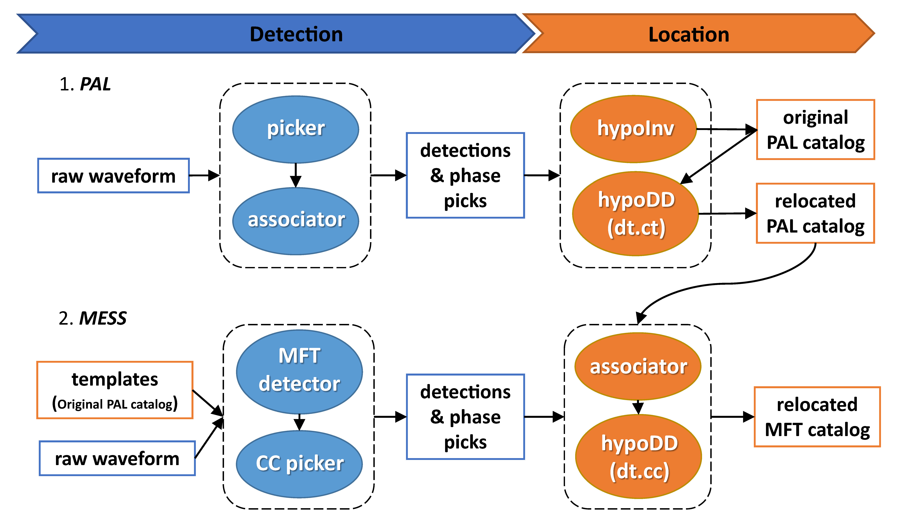

# PALM

Phase Picking, Association, Location, and Matched Filter workflow for building
high-resolution earthquake catalogs. PAL or AI-PAL detections can provide the
event templates used by the matched-filter (MFT) stage.

PALM v5.0 reorganizes the package into numbered executable workflows and shared
PAL and MFT source packages. It adds compact dual-rate NPY template storage,
buffered daily MFT scanning, high-resolution phase refinement, and final MFT
association products ready for hypoDD relocation.



## Project Layout

```text
PALM/
|-- 1_run_pal/       Numbered current PAL workflows for local or AWS execution
|-- 2_run_mft/       Numbered template-selection and matched-filter workflows
|-- 3_location/      Relocation tools for matched-filter detections
|-- PAL_src/         Shared current PAL implementation
|-- MFT_src/         Shared CPU/GPU MFT matched-filter implementation
`-- References/      Documentation files
```

Executable directories contain case settings, input metadata, and numbered
launchers. Shared source directories contain implementation code and should not
be edited or overwritten when starting a new experiment.

## 1. PAL

The PAL stage is synchronized with the current AI-PAL implementation. It
includes daily parallel picking, optional separate association, pre-QC STA/LTA
trigger inventories, current S picking, AWS waveform access, and resumable AWS
jobs. See [`1_run_pal/README.md`](1_run_pal/README.md).

`PALM/1_run_pal` and `AI-PAL/1_run_pal` use the same PAL implementation and
produce the same scientific output contract for identical inputs and settings:
daily accepted-pick files, STA/LTA trigger-count sidecars, subnet and merged
catalog/phase files, association-rate tables, and completion metadata. Their
installation roots, logs, job metadata, and configured output locations may
differ, so whole output trees are not expected to be byte-for-byte identical.

For a local example:

```bash
cd 1_run_pal/run_pal_local
python 1_run_pal_pick_assoc_eg.py
```

The split workflow runs the same scientific implementation:

```bash
python 2.1_run_pal_pick_eg.py
python 2.2_run_pal_assoc_eg.py
```

## 2. AI-PAL-Enriched Template Workflow

A common self-supervised workflow is:

1. Run PAL to obtain conservative phase detections and association rates.
2. Use those PAL products to cut training samples and train AI-PAL pickers.
3. Run the trained AI-PAL models on the continuous archive and associate,
   optionally repick/reassociate, and locate the enhanced detections.
4. Use the located AI-PAL events as the MFT templates.

This lets PAL provide the initial training supervision while the broader
AI-PAL catalog supplies a larger template bank for MFT. A direct PAL-to-MFT
path remains useful as a conservative baseline or when no trained AI-PAL model
is available. In `2_run_mft/1_select_templates_<case>.py`, set
`TEMPLATE_SOURCE = "ai-pal"` or `"pal"` and provide the matching detection and
located phase files in `TEMPLATE_INPUTS`.

The detection and located files must describe the same source catalog. The
selector uses the located event IDs to recover names from the corresponding
detection file; mixing a PAL detection file with an AI-PAL location file (or
the reverse) is invalid.

## 3. Matched Filter

The MFT stage performs conventional multi-station matched-filter detection,
followed by cross-correlation P- and S-pick refinement. Its input is a located
PAL phase file and the corresponding continuous waveforms.

```bash
cd 2_run_mft
python 1_select_templates_eg.py
python 2_cut_templates_eg.py
python 3.1_run_mft_gpu_eg.py
# or: python 3.2_run_mft_cpu_eg.py
```

Edit the user-settings block in each numbered launcher and the model parameters
in `config_<CASE_CODE>.py`. Launchers select that config without copying it into
`MFT_src/`, so multiple case workdirs can safely share one installed source.
See [`2_run_mft/README.md`](2_run_mft/README.md).

## 4. Location

The MFT stage associates duplicate template detections and writes `catalog.csv`,
`phase.csv`, `event.dat`, and `dt.cc`. `3_location/hypodd/` consumes the latter
two files and runs hypoDD relocation. Its external executable path and
case-specific location settings remain user configuration because hypoDD is
installed separately.

## Dependencies

The local PAL and MFT workflows require Python, NumPy, SciPy, ObsPy, and PyTorch.
GPU MFT additionally requires a CUDA-compatible PyTorch installation. External
location workflows require their corresponding hypoInverse or hypoDD binaries.

## References

- **Zhou, Y.**, H. Ding, A. Ghosh, and Z. Ge (2025). AI-PAL:
  Self-Supervised AI Phase Picking via Rule-Based Algorithm for Generalized
  Earthquake Detection. *Journal of Geophysical Research: Solid Earth*.
  [doi:10.1029/2025JB031294](https://doi.org/10.1029/2025JB031294)
- **Zhou, Y.**, A. Ghosh, L. Fang, H. Yue, S. Zhou, and Y. Su (2021). A
  High-Resolution Seismic Catalog for the 2021 MS 6.4/Mw 6.1 Yangbi Earthquake
  Sequence, Yunnan, China. *Earthquake Science*, 34(5), 390-398.
  [doi:10.29382/eqs-2021-0031](https://doi.org/10.29382/eqs-2021-0031)
- **Zhou, Y.**, H. Yue, L. Fang, S. Zhou, L. Zhao, and A. Ghosh (2021). An
  Earthquake Detection and Location Architecture for Continuous Seismograms:
  Phase Picking, Association, Location, and Matched Filter (PALM).
  *Seismological Research Letters*, 93(1), 413-425.
  [doi:10.1785/0220210111](https://doi.org/10.1785/0220210111)
